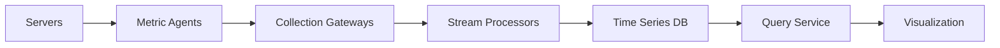
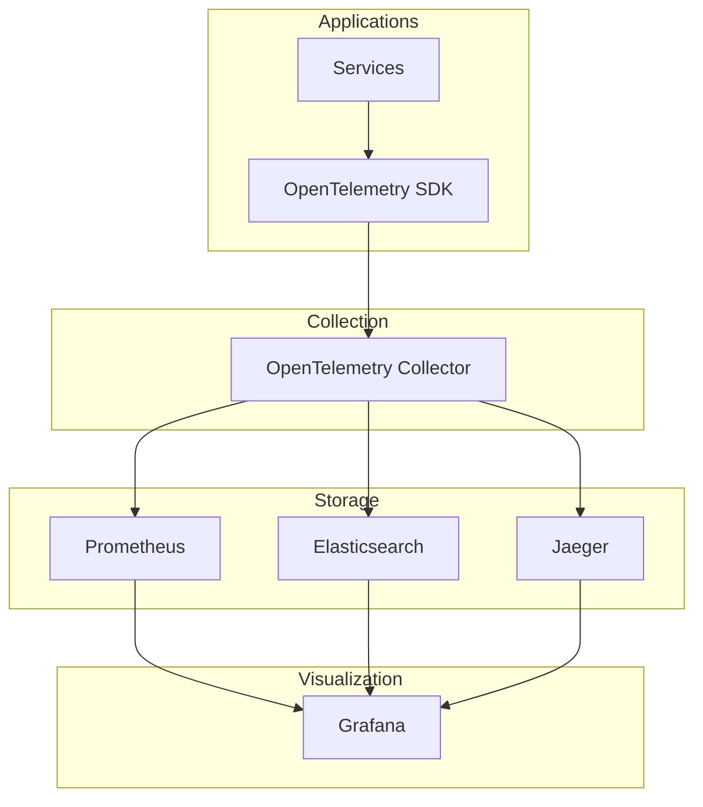
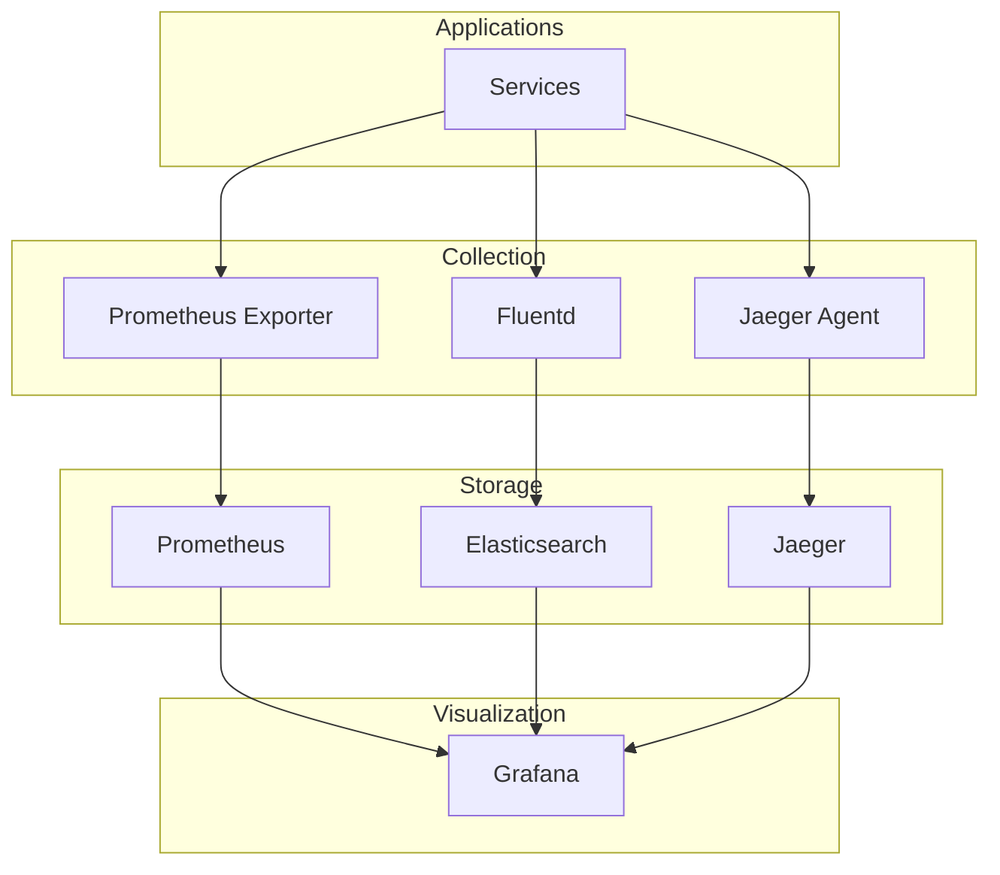

I'll help design a distributed system for collecting performance metrics at scale. Let's break this down into components and discuss the architecture, data flow, and key considerations.

# System Design: Distributed Metrics Collection System

## 1. High-Level Architecture Components

### a) Data Collection Layer
- **Metric Agents**: Lightweight processes running on each server
- **Collection Gateways**: Intermediate aggregation points
- **Load Balancers**: For distributing incoming metric traffic

### b) Processing Layer
- **Stream Processors**: For real-time metric processing
- **Aggregation Service**: For metric consolidation
- **Anomaly Detection**: For identifying outliers

### c) Storage Layer
- **Time Series Database**: Primary storage (e.g., Prometheus, InfluxDB)
- **Cache Layer**: For frequently accessed metrics
- **Long-term Storage**: For historical data

### d) Query Layer
- **Query Service**: API for metric retrieval
- **Visualization Tools**: Dashboards (e.g., Grafana)

## 2. Push vs. Pull Agents

### Push-based Approach
**Advantages:**
- Lower latency for critical metrics
- Better for dynamic infrastructure (cloud, containers)
- Works well with firewalled environments
- More control over transmission frequency

**Disadvantages:**
- Higher network load
- Need for buffering/queuing
- More complex error handling
- Risk of overwhelming receivers

### Pull-based Approach
**Advantages:**
- Better control over collection rate
- Automatic load balancing
- Simpler error handling
- Easy health checking

**Disadvantages:**
- Higher latency
- Requires accessible endpoints
- More complex service discovery
- May miss data between pulls

**Recommendation:** 
Consider a hybrid approach:
- Pull for standard metrics
- Push for critical/urgent metrics
- Push for ephemeral instances

## 3. Data Flow



1. **Collection:**
   - Agents collect server metrics
   - Metrics are batched and compressed
   - Data is tagged with metadata

2. **Processing:**
   - Stream processors validate data
   - Aggregation of similar metrics
   - Real-time anomaly detection

3. **Storage:**
   - Time-series data stored with TTL
   - Hot data in cache
   - Cold data in long-term storage

## 4. Resiliency & Availability Improvements

### a) Data Collection Resilience
- **Buffer Storage**: Local storage for network issues
- **Retry Mechanism**: Exponential backoff
- **Circuit Breakers**: Prevent cascade failures
- **Multiple Collection Paths**: Redundant gateways

### b) Processing Layer Resilience
- **Horizontal Scaling**: Auto-scaling processors
- **Load Shedding**: Drop non-critical metrics under load
- **Active-Active Setup**: Multiple processing clusters
- **Data Sampling**: Reduce load during stress

### c) Storage Layer Resilience
- **Replication**: Multi-region data copies
- **Sharding**: Distribute load across nodes
- **Backup Strategy**: Regular snapshots
- **Data Recovery**: Point-in-time recovery

### d) Query Layer Resilience
- **Caching**: Reduce database load
- **Rate Limiting**: Prevent abuse
- **Query Optimization**: Efficient data access
- **Read Replicas**: Separate read/write concerns

## 5. Implementation Considerations

### a) Scalability
- Use message queues for buffering
- Implement data compression
- Consider data retention policies
- Use efficient serialization formats

### b) Monitoring
- Monitor the monitoring system
- Set up alerts for collection issues
- Track end-to-end latency
- Monitor storage capacity

### c) Security
- Encrypt data in transit
- Implement authentication
- Regular security audits
- Access control for metrics

### d) Performance
- Optimize metric collection frequency
- Use efficient data structures
- Implement data aggregation
- Consider data cardinality

## 6. Best Practices

1. **Data Management:**
   - Define clear retention policies
   - Implement data lifecycle management
   - Use appropriate aggregation levels

2. **Operational:**
   - Document failure scenarios
   - Regular disaster recovery testing
   - Maintain operation runbooks
   - Monitor system health

3. **Development:**
   - Use version control for configurations
   - Implement CI/CD for updates
   - Regular performance testing
   - Maintain API compatibility

This design provides a robust foundation for collecting metrics at scale while ensuring resilience and availability. The hybrid push-pull approach offers flexibility, while the multi-layered architecture ensures reliability and scalability.


# Software Choices by Layer

## 1. Data Collection Layer

### Metric Agents

1. Prometheus Node Exporter

- Industry standard for Linux/Unix systems

- Rich set of system metrics

- Pull-based collection

1. Telegraf

- Plugin-based collection agent

- Supports both push and pull

- Wide range of input plugins

- Works well with InfluxDB

1. collectd

- Lightweight collection daemon

- Extensive plugin system

- C-based for performance

1. StatsD

- Simple UDP-based collection

- Good for application metrics

- Easy to implement

## 2. Collection Gateways/Aggregators

1. Vector

- Modern, fast data pipeline

- Written in Rust

- Supports both collection and routing

1. Fluentd/Fluent Bit

- Lightweight log/metric collector

- Extensive plugin ecosystem

- Good for containerized environments

1. Logstash

- Part of Elastic Stack

- Rich processing capabilities

- Good integration with Elasticsearch

1. OpenTelemetry Collector

- Vendor-agnostic collection

- Supports metrics, logs, and traces

- Strong cloud-native support

## 3. Message Queue/Stream Processing

1. Apache Kafka

- High-throughput message broker

- Excellent scalability

- Long-term storage capability

1. RabbitMQ

- Feature-rich message broker

- Multiple protocols support

- Good for smaller deployments

1. Apache Flink

- Stream processing framework

- Complex event processing

- Low latency processing

1. Apache Pulsar

- Modern pub-sub system

- Built-in stream processing

- Multi-tenant support

## 4. Time Series Databases

1. Prometheus

- Pull-based collection

- Powerful query language (PromQL)

- Built-in alerting

1. InfluxDB

- Purpose-built time series DB

- SQL-like query language

- Built-in data retention

1. TimescaleDB

- PostgreSQL extension

- SQL interface

- Good for mixed workloads

1. Victoria Metrics

- High-performance TSDB

- Prometheus compatible

- Good resource efficiency

## 5. Caching Layer

1. Redis

- In-memory data store

- Fast performance

- Rich data structures

1. Memcached

- Simple caching

- High performance

- Easy clustering

## 6. Long-term Storage

1. Object Storage

- Amazon S3

- Google Cloud Storage

- MinIO (self-hosted)

1. Thanos

- Long-term Prometheus storage

- Global query view

- Deduplication support

1. M3DB

- Distributed TSDB

- Long-term storage

- Uber-developed

## 7. Query and Visualization

1. Grafana

- De facto visualization platform

- Multiple data source support

- Rich alerting capabilities

1. Kibana

- Part of Elastic Stack

- Good for log analysis

- Built-in ML capabilities

1. Chronograf

- Part of InfluxDB stack

- Simple to use

- Good for InfluxDB

## 8. Service Discovery

1. Consul

- Service mesh capabilities

- Health checking

- Key-value store

1. Etcd

- Distributed key-value store

- Used by Kubernetes

- Strong consistency

1. Zookeeper

- Distributed coordination

- Strong consistency

- Traditional choice

## Example Stack Combinations

### Stack 1: Cloud Native

- Collection: Telegraf

- Gateway: Vector

- Processing: Apache Kafka

- Storage: Prometheus + Thanos

- Visualization: Grafana

- Service Discovery: Consul

### Stack 2: Enterprise

- Collection: collectd

- Gateway: Fluentd

- Processing: Apache Flink

- Storage: InfluxDB Enterprise

- Visualization: Grafana

- Service Discovery: Consul

### Stack 3: Lightweight

- Collection: Node Exporter

- Gateway: OpenTelemetry Collector

- Processing: RabbitMQ

- Storage: Victoria Metrics

- Visualization: Grafana

- Service Discovery: etcd

## Considerations for Selection

1. Scale Requirements

- Data volume

- Number of sources

- Query patterns

1. Operational Complexity

- Team expertise

- Maintenance overhead

- Available resources

1. Cost Considerations

- License costs

- Infrastructure requirements

- Operational costs

1. Integration Requirements

- Existing tools

- Protocol support

- API compatibility

1. Support and Community

- Commercial support

- Community size

- Documentation quality

I'll explain how to extend your metrics architecture to include logs and traces. Here's how the architecture would evolve:

# Extending to Full Observability Platform

## 1. Key Architectural Changes

### a) Collection Layer Changes
- **Original**: Metric agents only
- **New Components**:
  1. Log collectors (e.g., Fluentd, Vector)
  2. Trace collectors (e.g., OpenTelemetry Collector)
  3. Unified collection agents

### b) Processing Layer Changes
- **Original**: Metric stream processing
- **New Components**:
  1. Log parsing and enrichment pipeline
  2. Trace aggregation and sampling
  3. Correlation service for linking all three signals

### c) Storage Layer Changes
- **Original**: Time Series DB
- **New Components**:
  1. Log storage (e.g., Elasticsearch)
  2. Trace storage (e.g., Jaeger)
  3. Correlation metadata store

## 2. Modern Implementation Approach

### Option 1: OpenTelemetry-Based Stack (Recommended)



**Benefits:**
- Single collection agent
- Standardized instrumentation
- Vendor neutrality
- Future-proof

### Option 2: Specialized Tools Stack



## 3. Key Changes Required

### a) Application Instrumentation
```python
# Example using OpenTelemetry
from opentelemetry import trace, metrics, logs
from opentelemetry.trace import Status, StatusCode

tracer = trace.get_tracer(__name__)
meter = metrics.get_meter(__name__)
logger = logs.get_logger(__name__)

def process_request():
    with tracer.start_as_current_span("process_request") as span:
        # Metrics
        request_counter = meter.create_counter("requests")
        request_counter.add(1)
        
        # Logs
        logger.info("Processing request", 
                   trace_id=span.get_span_context().trace_id)
        
        # Business logic
        result = do_work()
        
        # Trace status
        span.set_status(Status(StatusCode.OK))
```

### b) Correlation Implementation
```python
# Correlation through context propagation
from opentelemetry.trace import format_trace_id

def handle_request(request):
    current_span = trace.get_current_span()
    trace_id = format_trace_id(current_span.get_span_context().trace_id)
    
    # Add trace context to all signals
    logger.info("Request received", 
                extra={
                    "trace_id": trace_id,
                    "span_id": current_span.get_span_context().span_id
                })
    
    metrics.counter("requests").add(1, {
        "trace_id": trace_id
    })
```

## 4. Storage Considerations

### a) Data Volume Management
- Implement sampling strategies
- Set retention policies per signal type
- Use tiered storage

```yaml
# Example retention configuration
storage:
  metrics:
    hot_storage: 15d    # Prometheus
    cold_storage: 365d  # Object Storage
  logs:
    hot_storage: 7d     # Elasticsearch
    warm_storage: 30d   # Reduced replicas
    cold_storage: 180d  # Object Storage
  traces:
    storage: 15d        # Jaeger
    sampling_rate: 0.1  # 10% of traces
```

### b) Query Optimization
- Index critical fields
- Implement caching
- Use materialized views for common queries

## 5. Operational Changes

### a) Monitoring Updates
- Monitor collection agents
- Track data volume per signal
- Alert on correlation breaks

### b) Resource Requirements
```yaml
# Example resource allocation
collection:
  otel_collector:
    cpu: 2
    memory: 4Gi
    instances: 3

storage:
  prometheus:
    cpu: 4
    memory: 16Gi
  elasticsearch:
    cpu: 8
    memory: 32Gi
  jaeger:
    cpu: 4
    memory: 16Gi
```

## 6. Best Practices

1. **Unified Collection**
   - Use OpenTelemetry where possible
   - Standardize metadata/labels
   - Implement consistent sampling

2. **Data Management**
   - Different retention per signal type
   - Sampling strategies per environment
   - Cost-based storage decisions

3. **Correlation**
   - Consistent trace ID propagation
   - Standard label naming
   - Automated correlation checks

4. **Query Optimization**
   - Cache common queries
   - Implement query timeouts
   - Use appropriate indices

This architecture provides a complete observability solution while maintaining the existing metrics capabilities. The key is to implement proper correlation between signals while managing the increased data volume and complexity.
