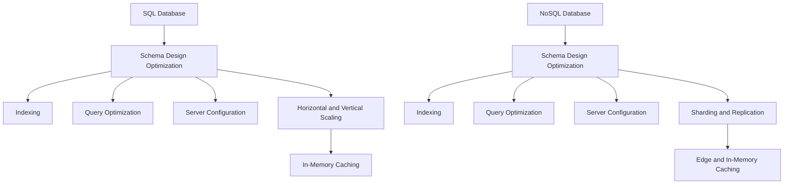

Improving the performance of SQL and NoSQL databases involves optimizing various aspects of their operation, from the database design and indexing to query performance and server configuration. Here’s a comprehensive approach for each type of database:

---

## SQL Databases

### 1. **Database Design and Schema Optimization**

**Actions:**
- **Normalization:** Ensure the schema is normalized to reduce data redundancy and improve data integrity.
- **Denormalization:** In some cases, denormalize the schema to reduce the number of joins required for queries.
- **Appropriate Data Types:** Use the correct data types for columns to save space and improve performance.

### 2. **Indexing**

**Actions:**
- **Primary and Foreign Keys:** Ensure that primary and foreign keys are indexed.
- **Composite Indexes:** Use composite indexes for columns that are frequently queried together.
- **Covering Indexes:** Create covering indexes to include all columns used in a query, reducing the need for accessing the table.
- **Avoid Over-Indexing:** Too many indexes can slow down write operations and increase storage requirements.

**Tools:**
- **Index Advisor:** Tools like SQL Server’s Database Engine Tuning Advisor or MySQL’s Performance Schema can recommend indexes.

### 3. **Query Optimization**

**Actions:**
- **Explain Plans:** Use `EXPLAIN` or `EXPLAIN PLAN` to analyze query performance and identify bottlenecks.
- **Optimize Joins:** Minimize the number of joins and ensure they are on indexed columns.
- **Avoid Select *:** Fetch only the columns needed instead of using `SELECT *`.
- **Parameterize Queries:** Use parameterized queries to avoid repetitive parsing and reduce the risk of SQL injection.

**Tools:**
- **Query Profiler:** Use tools like MySQL’s `EXPLAIN` or PostgreSQL’s `EXPLAIN ANALYZE` to profile queries.

### 4. **Server and Configuration Optimization**

**Actions:**
- **Memory Allocation:** Allocate sufficient memory for the database buffer pool or cache.
- **Connection Pooling:** Use connection pooling to manage database connections efficiently.
- **Optimize Disk I/O:** Use faster storage options like SSDs and configure RAID for redundancy and performance.
- **Database Maintenance:** Regularly perform maintenance tasks like indexing, vacuuming (PostgreSQL), or OPTIMIZE TABLE (MySQL).

**Tools:**
- **Configuration Tools:** Use tools like Percona Toolkit for MySQL or pgTune for PostgreSQL to optimize server settings.

### 5. **Horizontal and Vertical Scaling**

**Actions:**
- **Vertical Scaling:** Increase server resources like CPU and RAM.
- **Horizontal Scaling:** Use sharding or partitioning to distribute data across multiple servers.

**Commercial Solutions:**
- **Cloud Databases:** Use managed services like Amazon RDS, Google Cloud SQL, or Azure SQL Database that support auto-scaling and provide built-in optimization tools.

### 6. **Caching Strategies**

**Actions:**
- **Query Caching:** Use query caching to store the results of expensive queries.
- **In-Memory Caching:** Use in-memory caches like Redis or Memcached to store frequently accessed data.

---

## NoSQL Databases

### 1. **Schema Design Optimization**

**Actions:**
- **Document Structure:** In document databases like MongoDB, design documents to include the necessary data to minimize the number of reads.
- **Key Design:** In key-value stores like Redis, use efficient keys and values that reduce storage overhead.
- **Data Distribution:** Design your schema to take advantage of the database’s partitioning and replication features.

### 2. **Indexing**

**Actions:**
- **Create Indexes:** Create indexes on fields that are frequently queried to speed up read operations.
- **Composite Indexes:** Use composite indexes in document stores for queries involving multiple fields.
- **Limit Index Size:** Avoid creating large indexes that can consume excessive memory and slow down writes.

**Tools:**
- **Indexing Tools:** Use MongoDB’s `db.collection.createIndex()` or Cassandra’s secondary indexes to create and manage indexes.

### 3. **Query Optimization**

**Actions:**
- **Use Aggregation:** Use aggregation pipelines in MongoDB to reduce the amount of data transferred and processed.
- **Optimize Filters:** Ensure filters are applied efficiently and leverage indexes.
- **Avoid Full Scans:** Design queries to avoid full table or collection scans, which can be slow and resource-intensive.

**Tools:**
- **Query Profilers:** Use MongoDB’s query profiler or Couchbase’s `EXPLAIN` function to analyze and optimize queries.

### 4. **Server and Configuration Optimization**

**Actions:**
- **Memory Management:** Ensure adequate memory is allocated to handle data and indexes in memory.
- **Replication and Sharding:** Use replication for fault tolerance and sharding to distribute data and balance load.
- **Optimize Storage:** Use fast storage solutions like SSDs and configure for optimal I/O performance.

**Tools:**
- **Management Tools:** Use tools like MongoDB Ops Manager or Couchbase’s Web Console to monitor and optimize database performance.

### 5. **Horizontal Scaling**

**Actions:**
- **Sharding:** Use sharding to distribute data across multiple servers to handle large datasets and high query throughput.
- **Replication:** Use replication to ensure high availability and redundancy.

**Commercial Solutions:**
- **Managed Services:** Use managed services like Amazon DynamoDB, Google Firestore, or Azure Cosmos DB that offer built-in horizontal scaling and high availability.

### 6. **Caching Strategies**

**Actions:**
- **In-Memory Caching:** Use in-memory caches to store frequently accessed data to reduce latency.
- **Edge Caching:** For geographically distributed applications, use edge caching to serve data closer to the user.

**Commercial Solutions:**
- **Cache Services:** Use services like Amazon ElastiCache or Azure Cache for Redis to implement caching.

---

## Summary Diagram

Below is a control flow diagram representing the various stages and components involved in optimizing both SQL and NoSQL databases:

### Control Flow Explanation

1. **Schema Design Optimization:** Start by optimizing the schema design to ensure efficient data storage and retrieval.
2. **Indexing:** Implement and optimize indexing to speed up read operations.
3. **Query Optimization:** Analyze and optimize queries to reduce execution time.
4. **Server Configuration:** Configure the server for optimal performance, including memory management and disk I/O optimization.
5. **Scaling:** Implement horizontal and vertical scaling to handle increased load and large datasets.
6. **Caching:** Use in-memory and edge caching to reduce latency and improve performance.

By addressing these components, you can significantly improve the performance of both SQL and NoSQL databases, ensuring faster response times and better scalability.